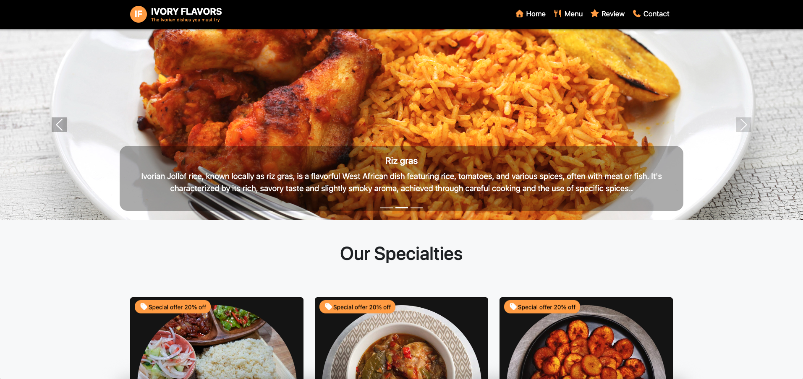

# Ivory Flavors - Authentic Ivorian Restaurant Website

GitHub: https://github.com/Doumbiasoft

A modern, responsive restaurant website showcasing authentic Ivorian cuisine and West African culinary traditions.

## Live at: https://doumbiasoft.github.io/ivory-flavors/

## 🍽️ About

Ivory Flavors is a restaurant website dedicated to bringing the rich culinary traditions of Côte d'Ivoire to life. The site features authentic West African dishes prepared with traditional recipes passed down through generations, from the bustling markets of Abidjan to your table.



## ✨ Features

### 🏠 Home Page

- **Hero Carousel**: Interactive slideshow featuring signature dishes (Jollof Rice, Riz Gras, Garba)
- **Our Specialties**: Showcase of featured dishes with large circular images and special offers
- **Our Story**: Restaurant background and culinary philosophy
- **Newsletter Subscription**: Footer newsletter signup

### 🍴 Menu Page

- **Interactive Menu Table**: Comprehensive menu with dish images, descriptions, and prices
- **Spice Level Indicators**: Visual spice level ratings for each dish
- **Menu Filtering**: Dropdown filter for spicy/non-spicy dishes
- **Card Layout**: Professional table design wrapped in styled cards

### ⭐ Review Page

- **Customer Reviews**: Grid layout of authentic customer testimonials
- **Star Ratings**: Visual 5-star rating system
- **Customer Photos**: Profile images for each reviewer
- **Responsive Cards**: Mobile-friendly review display

### 📞 Contact Page

- **Contact Form**: Full-featured contact form with validation
- **Restaurant Information**: Address, phone, email, and hours
- **Social Media Links**: Facebook, Instagram, Twitter, Yelp
- **Location Visualization**:
  - Animated GIF showing restaurant ambiance
  - Embedded Google Maps for precise location
- **Responsive Layout**: Mobile-first design with proper spacing

## 🛠️ Technologies Used

- **HTML5**: Semantic markup structure
- **CSS3**: Custom styling with modern features
- **Bootstrap 5.3.7**: Responsive framework and components
- **Font Awesome 7.0.0**: Icons and visual elements
- **JavaScript**: Bootstrap interactive components

## 📱 Design Features

### Visual Design

- **Color Scheme**:
  - Primary: `#f8a444` (Golden orange)
  - Secondary: `#141414` (Dark gray)
  - Background: Black with light tertiary accents
- **Typography**: Clean, readable fonts with proper hierarchy

### Responsive Design

- **Mobile-First**: Optimized for mobile devices
- **Bootstrap Grid**: Responsive column layouts
- **Flexible Images**: Properly sized and optimized images
- **Touch-Friendly**: Large buttons and interactive elements

### User Experience

- **Fixed Navigation**: Always accessible navigation bar
- **Smooth Animations**: CSS animations and transitions
- **Accessibility**: Proper alt tags and semantic HTML

## 🏗️ Project Structure

```text
ivory-flavors/
├── README.md
├── index.html                 # Home page
├── pages/
│   ├── menu.html             # Menu page
│   ├── review.html           # Reviews page
│   └── contact.html          # Contact page
├── styles/
│   └── app.css               # Custom stylesheet
└── images/                   # Image assets
    ├── slide-*.jpg           # Carousel images
    ├── *-dish.jpg           # Food photography
    └── *.png                # Icons and graphics
```

## 🤔 Reflection

### What would you add to or change about your website if given more time?

**Enhanced Features:**

- **Interactive Menu**: Add filtering by dietary restrictions, search functionality, and nutritional information
- **HTML Templating**: To have reusable elements across pages
- **JavaScript**: To indicate page navigation and also have better interaction

**Code Organization:**

- Separate concerns better (CSS modules, JavaScript components)
- Use CSS custom properties for theme consistency
- Implement a naming convention (BEM methodology)
- Create reusable components from the start
